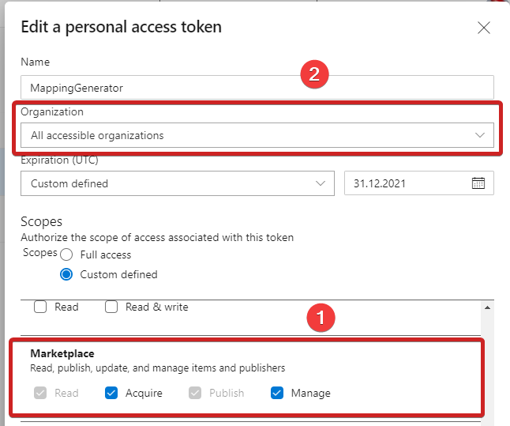

# VsixPublisher Github Action
GithubAction for publishing extensions to Visual Studio Marketplace


## Example usage

```yml
- name: Publish extension to Marketplace
  uses: cezarypiatek/VsixPublisherAction@0.2
  with:
      extension-file: src\MappingGenerator.Vsix\bin\Release\MappingGenerator.vsix
      publish-manifest-file: src\MappingGenerator.Vsix\publishManifest.json
      personal-access-code: ${{ secrets.VS_PUBLISHER_ACCESS_TOKEN }}
```

Example `publishManifest.json`

```json
{
    "$schema": "http://json.schemastore.org/vsix-publish",
    "categories": [
        "coding",
        "scaffolding"
    ],
    "identity": {
        "internalName": "mappinggenerator"
    },
    "overview": "overview.md",
    "priceCategory": "free",
    "publisher": "54748ff9-45fc-43c2-8ec5-cf7912bc3b84",
    "private": false,
    "qna": true,
    "repo": "https://github.com/cezarypiatek/MappingGenerator"
}
```


See also:

[publishManifest file reference](https://docs.microsoft.com/en-us/visualstudio/extensibility/walkthrough-publishing-a-visual-studio-extension-via-command-line?view=vs-2019#publishmanifest-file)

[How to generate Personal Access Token](https://code.visualstudio.com/api/working-with-extensions/publishing-extension#get-a-personal-access-token)

## Troubleshooting

### An open ended version range

**Error Message:** `VSSDK: error VsixPub0029 : An error occurred while communicating with the marketplace: VSIXValidatorWarning08 - (CsharpMacros) An open ended version range was detected in an InstallationTarget element in the .vsixmanifest file.` 

**Solution:** Make sure that `PackageManifest/Installation/InstallationTarget@Version` is a range with both ends defined explicitly. 
Example of correct manifest:

```xml
<PackageManifest Version="2.0.0" xmlns="http://schemas.microsoft.com/developer/vsx-schema/2011" xmlns:d="http://schemas.microsoft.com/developer/vsx-schema-design/2011">
  <Installation>
    <InstallationTarget Id="Microsoft.VisualStudio.Community" Version="[15.0, 17.0)" />
  </Installation>
</PackageManifest>
```

### Missing permissions in API Key

**Error Message:** ` Response status code does not indicate success: 403 (The specified API key is invalid, has expired, or does not have permission to access the specified package.).`

**Solution:** 
1) Make sure that you set `Acquire` and `Manage` permission in the section `Marketplace` of your Personal Access Token configuration. 
2) Sometimes you need also set `Organization` to the `All accessible organization`.



## How to build github action

```
docker run -v ${pwd}:/action -it  node:16-alpine /bin/sh
cd action
npm i -g @vercel/ncc
npm install
ncc build ./src/main.ts
```